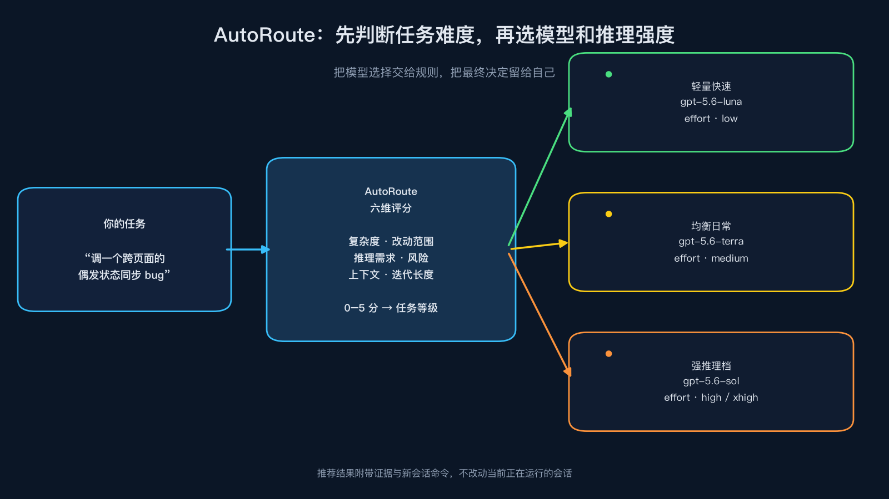
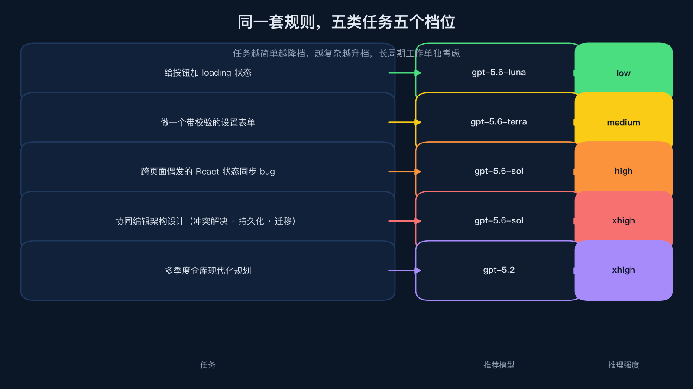
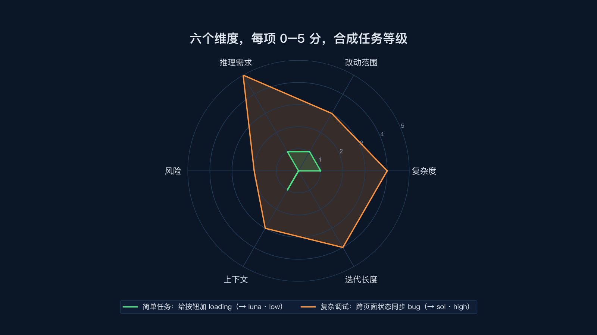
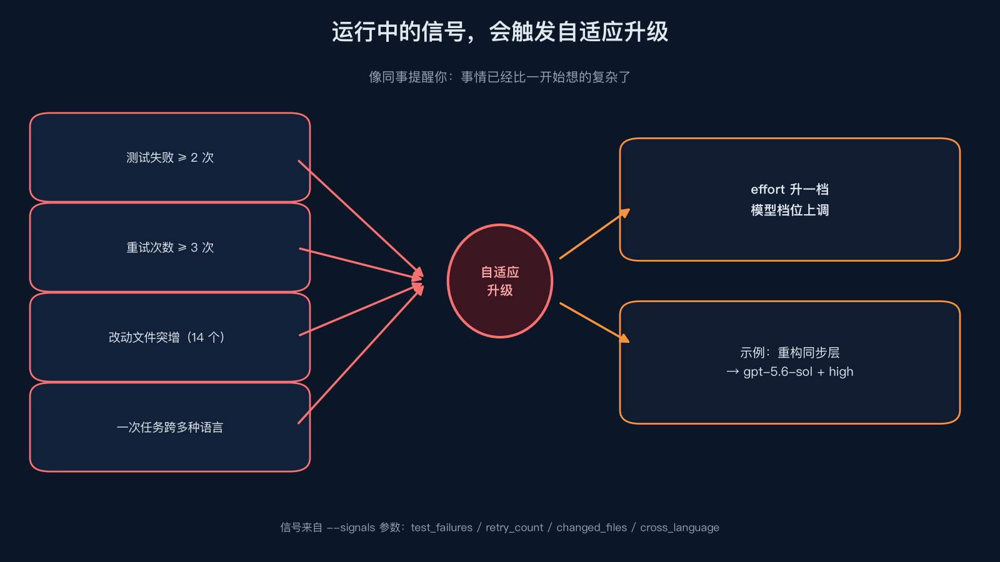

# 别再拿大炮打蚊子了，我给 Codex 加了一个自动选模型的方向盘



事情是这样的。

最近在用 Codex 做项目，遇到一个挺现实的问题，同一个账号里有好几个模型，模型名看着都很厉害，可每次到底该用哪个，还是得自己选。但是自己每次都忘记选，基本都是 `gpt-5.6-sol high`。

改一个按钮的 loading 状态，开最强模型，多少有点浪费。

遇到跨模块的状态同步 bug，却为了省一点额度，硬让轻量模型反复试错，最后时间全花在重跑上。

模型越来越多，选择反而越来越像一道题。

所以我做了 AutoRoute，一个给 Codex 用的路由 skill。它不负责替你写代码，也不碰你当前正在运行的会话——**它是先分析任务，推荐更合适的模型和推理强度，并准备一条新会话命令**。

你可以把它理解成一个方向盘。

你只管说要做什么，它来帮你判断这次该用小模型快速处理，还是把任务交给更强的模型认真推一遍。

我拿几类任务实际跑了一遍，效果挺直观。

1. 给按钮加 loading 状态，AutoRoute 推荐 `gpt-5.6-luna`，推理强度 `low`。

2. 做一个带校验的设置表单，推荐 `gpt-5.6-terra`，推理强度 `medium`。

3. 调一个跨页面、偶发出现的 React 状态同步问题，推荐 `gpt-5.6-sol`，推理强度 `high`。

4. 设计一个带冲突解决、持久化和迁移计划的协同编辑架构，直接上 `gpt-5.6-sol`，推理强度 `xhigh`。

5. 指定 `--workload long_horizon`（或 prompt 里带上 `roadmap` / `long-term` 等关键词），它会根据你模型目录里实际可用的模型做选择；如果清单里有 `gpt-5.2`，会优先考虑它，否则就回退到清单里其他合适的模型。



这不是简单的关键词匹配。

AutoRoute 会从六个方向看任务，复杂度、改动范围、推理需求、风险、上下文大小，还有后续迭代长度。每一项是 0 到 5 分，最后合成一个任务等级，再分别决定模型和 effort。



这里有个细节挺重要，**模型和推理强度是分开选的**。

有些任务并不复杂，但需要多想几步，可能模型不用换，effort 先升一档就够了。反过来，有的任务描述看着不长，背后却牵扯生产数据、兼容性和回滚，那模型和 effort 都应该更谨慎。

很多路由工具只看任务文字里有没有 debug、migration 这些词，AutoRoute 会把证据一起输出。你能看到它为什么给出这个建议，而不是被一个黑盒结论牵着走。

输出大概是这样，命令也会一并给出来。

```text
model  gpt-5.6-sol
effort  high
level   high
workload debugging
```

然后它会准备一条新会话命令，类似这样。

```bash
codex -m gpt-5.6-sol -c model_reasoning_effort="high" \
  "Debug an intermittent React state synchronization bug across the page"
```

>注意，**是准备新会话，不是偷偷改掉你眼前这次对话的模型**。Skill 没法改变已经启动的 Codex 会话，这个边界 AutoRoute 讲得很清楚。你确认推荐没问题，再用 `--run` 启动新的 Codex 进程。

安装也不复杂，把仓库放到个人 skills 目录就行。

```bash
git clone https://github.com/you-want/AutoRoute.git ~/.codex/skills/autoroute
```

然后在 Codex 里调用 `$autoroute`，或者直接跑脚本。

```bash
python3 ~/.codex/skills/autoroute/scripts/autoroute.py \
  "Debug intermittent React state synchronization"
```

如果你已经有自己的模型目录，也可以显式传进去。

```bash
# 先复制示例配置（按你自己的实际模型调整 slug）
cp ~/.codex/skills/autoroute/rules/codex-models.example.json ~/.codex/autoroute.json

# 然后用默认配置运行
python3 ~/.codex/skills/autoroute/scripts/autoroute.py \
  "Add a loading state to the Button component"
```

> 下面用仓库里的测试目录演示，仅作说明。实际使用时请换成你自己确认可用的模型目录。

```bash
python3 ~/.codex/skills/autoroute/scripts/autoroute.py \
  --models-file ~/.codex/skills/autoroute/tests/catalog.json \
  "Add a loading state to the Button component"
```

显式传入的目录会被当成完整清单，不会和机器上的其他缓存模型混在一起。这一点对自定义供应商尤其有用，不然你本地明明只配置了两个模型，路由结果却被别的缓存内容带偏，排查起来很烦。

模型可用性也不是想当然。

AutoRoute 第一次运行，或者缓存超过默认的 15 分钟，会尝试做轻量探测。探测被权限或沙箱拦住时，结果会标记为 `blocked`（全部受阻）或 `partial`（部分受阻），同时保留已经发现的目录继续路由，不会因为一次环境限制就武断地说模型不可用。

这类细节平时不显眼，真到 provider 返回 503、测试环境没有完整模型目录时，就能少踩不少坑。

还有一个我自己比较看重的地方，AutoRoute 会根据运行中的信号自适应升级。

测试失败次数增加、重试次数过多、改动文件突然变多，或者一次任务跨了好几种语言，都**可能**让评分升高，进而触发更高的 effort 或模型档位。比如重构同步层时，如果已经连续失败两次、重试三次、改了 14 个文件，推荐会从普通任务升级到 `gpt-5.6-sol` 加 `high`。

这很像一个靠谱的同事在旁边提醒你，事情已经比最开始想的复杂了，别再用原来的配置硬顶。



当然，它也不是算命的。

任务描述写得越清楚，评分越靠谱。你如果只丢一句「把系统改好」，它只能按有限线索做保守判断。对于架构设计、迁移和安全相关工作，我更建议你自己补充语义评分，或者直接指定 workload。

```bash
python3 ~/.codex/skills/autoroute/scripts/autoroute.py \
  --workload high_risk \
  --scores '{"complexity":4,"scope":5,"reasoning":4,"risk":5,"context":4,"iteration":4}' \
  "Plan the production authentication migration"
```

另外，自动路由不等于一定省钱。

模型不可用、任务失败、来回重试，都会把成本拉回来。真正应该看的，是成功率、结果质量、总 token、重试次数和耗时。仓库里已经放了评测脚本，可以跑控制组和路由组做对比，不要拿一两个任务就急着下结论。

```bash
cd ~/.codex/skills/autoroute
python3 tests/test_autoroute.py
python3 scripts/run_evals.py --models-file tests/catalog.json
```

我觉得 AutoRoute 最适合的，不是那种每天只用一个模型、任务也很固定的人。它更适合下面这种状态，项目在持续变大，模型选择越来越多，任务有时是小修小补，有时又突然变成跨模块排查。你不想每次都从模型列表重新做一遍判断，但也不愿意把所有活都丢给最贵的那一个。

**把模型选择交给规则，把最终决定留给自己。**

这就是我做这个 skill 的出发点。

它现在还很朴素，路由策略也会继续调整。但至少在我自己的测试里，简单任务确实会降档，复杂任务确实会升档，长周期工作也不会和一次性小改动用同一套配置。

如果你也在用 Codex，欢迎把它装上试试。跑几个你熟悉的任务，看它的判断是不是符合你的直觉，再决定要不要接入日常工作流。

工具不应该增加新的负担。

它只需要在你犹豫「这次到底该用哪个模型」的时候，帮你少想一会儿。

以上，既然看到这里了，如果觉得这个项目有点用，欢迎去 GitHub 点个 star，也欢迎把你遇到的路由问题提出来。一个人的规则总有盲区，多跑几种真实任务，AutoRoute 才会越来越像一个真正能帮上忙的工具。

谢谢你看到这里，我们下次再见。

> 作者，Rain9

> 项目地址，https://github.com/you-want/AutoRoute
